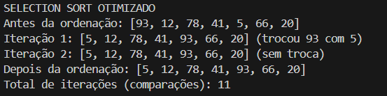
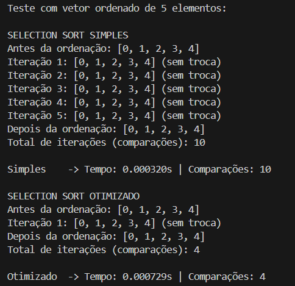
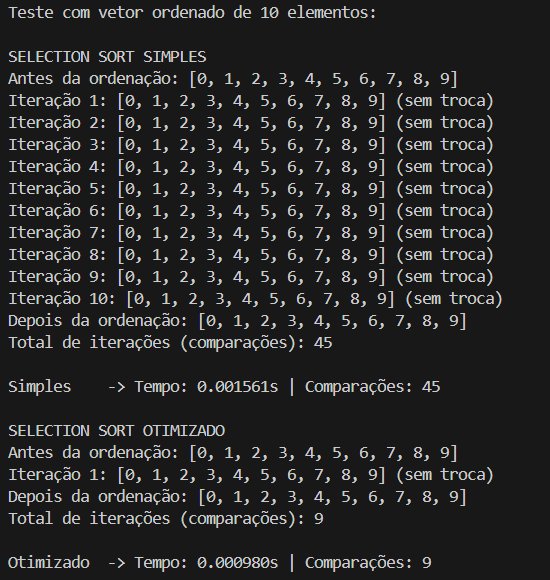
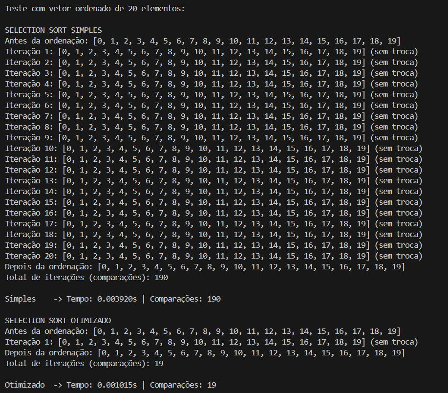

# 📋 Atividade 02: Implementação do Algoritmo Selection Sort

**Disciplina:** Estrutura de Dados II  
**Curso:** Análise e Desenvolvimento de Sistemas  
**Campus:** Patrocínio  
**Período:** 1º Semestre de 2025  
**Aluno:** Gabriel Henrique Moreira de Souza  
**Data de Entrega:** 26/03/2025  

---

## 📌 Objetivo

Nesta atividade, foi solicitado implementar o algoritmo de ordenação **Selection Sort** utilizando a linguagem Python. Além da versão simples, foi desenvolvida uma versão otimizada, com o objetivo de evitar comparações desnecessárias. A atividade também exige exibir o vetor a cada iteração e comparar os desempenhos das duas versões.

---

## 💻 Implementação

### 🔸 Versão Simples

Exibe o vetor a cada iteração e realiza trocas apenas quando necessário. O algoritmo percorre toda a lista mesmo que já esteja ordenada.

📷 Resultado da execução:

---

### 🔹 Versão Otimizada

Além da lógica do Selection Sort, essa versão detecta se houve troca em cada iteração. Se nenhuma troca ocorrer, o algoritmo é encerrado antecipadamente.

📷 Resultado da execução:

---

## 🧪 Testes com Vetores Ordenados

Os testes foram realizados com vetores **já ordenados**, contendo 5, 10 e 20 elementos. O objetivo foi medir o número de comparações e o tempo de execução, observando o impacto da otimização.

---

### ✅ Vetor com 5 elementos

📷  

---

### ✅ Vetor com 10 elementos

📷  

---

### ✅ Vetor com 20 elementos

📷  

---

## 📊 Análise de Desempenho

| Tamanho do Vetor | Comparações (Simples) | Comparações (Otimizado) | Observações |
|------------------|------------------------|--------------------------|-------------|
| 5 elementos      | 10                     | 4                        | Interrompe após 1ª iteração |
| 10 elementos     | 45                     | 9                        | Otimizado corta 36 comparações |
| 20 elementos     | 190                    | 19                       | Otimizado é muito mais eficiente |

---

## ✅ Conclusão

A otimização no algoritmo Selection Sort demonstrou ser extremamente eficaz em casos onde o vetor já está ordenado, economizando muitas comparações e tempo de processamento. Essa abordagem é útil em situações práticas onde os dados de entrada já estão parcialmente organizados.

---

## 👨‍💻 Autor

Gabriel Henrique Moreira de Souza  
Patrocínio/MG — 2025  
